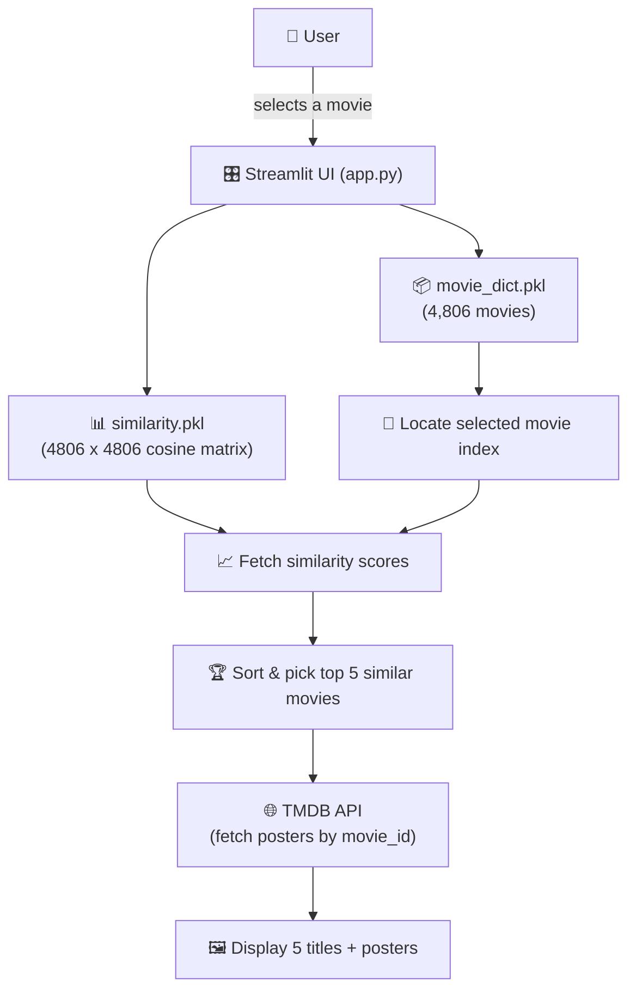
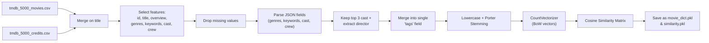

# 🎬 Movie Recommendation System

<p align="center">
  
  
  
  
  
</p>

<p align="center">
A content-based movie recommender that suggests the top 5 most similar movies to any title you pick — powered by TMDB metadata, NLP feature engineering, and cosine similarity.
</p>

---

## 📌 Table of Contents

- [Overview](#-overview)
- [Demo](#-demo)
- [System Architecture](#-system-architecture)
- [ML Pipeline](#-ml-pipeline)
- [Tech Stack](#-tech-stack)
- [Project Structure](#-project-structure)
- [Installation](#-installation)
- [Usage](#-usage)
- [Limitations](#-limitations)
- [Future Improvements](#-future-improvements)

---

## 🧠 Overview

This project is a **content-based movie recommendation system** built with Python and Streamlit, using the **TMDB 5000 Movie Dataset**.

The system analyzes movie **overview, genres, keywords, cast, and director** metadata, combines them into a unified `tags` field, vectorizes them with `CountVectorizer`, and computes pairwise **cosine similarity** across all 4,806 movies. When a user selects a movie, the app returns the 5 most similar titles along with posters fetched live from the **TMDB API**.

---

## 🎥 Demo


---

## 🏗 System Architecture



---

## ⚙️ ML Pipeline



**Steps:**

1. Load `tmdb_5000_movies.csv` and `tmdb_5000_credits.csv`.
2. Merge both datasets on movie title.
3. Keep: `movie_id`, `title`, `overview`, `genres`, `keywords`, `cast`, `crew`.
4. Drop rows with missing values.
5. Parse JSON-formatted `genres`, `keywords`, `cast`, `crew`.
6. Keep the top 3 cast members.
7. Extract the director from crew data.
8. Combine overview + genres + keywords + cast + director → `tags`.
9. Lowercase all tags.
10. Apply Porter stemming.
11. Vectorize tags using `CountVectorizer`.
12. Compute cosine similarity across all movies.
13. Serialize processed data and similarity matrix as `.pkl` files.

---

## 🛠 Tech Stack

| Category | Tools |
|---|---|
| Language | Python |
| Web App | Streamlit |
| Data Handling | Pandas, NumPy |
| ML / NLP | Scikit-learn (`CountVectorizer`, cosine similarity), NLTK (Porter Stemmer) |
| External API | TMDB API (posters) |
| Serialization | Pickle |

---

## 📁 Project Structure

```
movie-recommendation-system/
├── app.py                              # Streamlit app + recommendation logic
├── Movie_Recommandation_System.ipynb   # Data preprocessing & model generation
├── tmdb_5000_movies.csv                # Movie metadata
├── tmdb_5000_credits.csv               # Cast & crew metadata
├── models/
│   ├── movie_dict.pkl                  # Processed movie data (4,806 movies)
│   └── similarity.pkl                  # Precomputed 4806x4806 similarity matrix
├── requirements.txt                    # Python dependencies
└── README.md
```

---

## 💻 Installation

```bash
git clone https://github.com/darshil2032007/movie-recommendation-system.git
cd movie-recommendation-system
pip install -r requirements.txt
```

---

## 🚀 Usage

```bash
streamlit run app.py
```

1. Open the local Streamlit URL shown in the terminal.
2. Select a movie from the dropdown.
3. Click **Recommend**.
4. View the top 5 similar movies with posters.

---

## ⚠️ Limitations

- Content-based only — not personalized to individual user behavior/ratings.
- Recommendations depend solely on metadata quality (overview, genres, keywords, cast, director).
- The selected movie must exist in the processed dataset.
- Poster retrieval requires internet access and a valid TMDB API key.
- The TMDB API key is currently hard-coded in `app.py` — move it to Streamlit secrets or an environment variable before deploying.
- Recommendation quality is bounded by the original TMDB metadata and the chosen vectorization method (`CountVectorizer` vs. TF-IDF).

---

## 🔮 Future Improvements

- [ ] Move TMDB API key to `.env` / Streamlit secrets.
- [ ] Switch to TF-IDF or embeddings (e.g., Sentence-BERT) for richer similarity.
- [ ] Add collaborative filtering using user ratings for hybrid recommendations.
- [ ] Cache TMDB API responses to reduce latency and API calls.
- [ ] Deploy on Streamlit Community Cloud / Docker.

---

<p align="center">Made with 🐍 Python & ❤️</p>